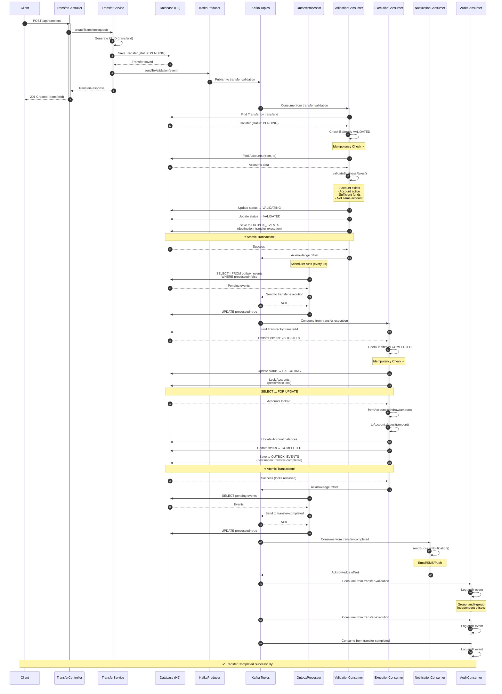

# Banking System - Transfer Flow

## Sequence Diagram

```mermaid
sequenceDiagram
    autonumber
    participant Client
    participant API as TransferController
    participant Service as TransferService
    participant DB as Database (H2)
    participant Producer as KafkaProducer
    participant Kafka as Kafka Topics
    participant Outbox as OutboxProcessor
    participant ValidationC as ValidationConsumer
    participant ExecutionC as ExecutionConsumer
    participant NotificationC as NotificationConsumer
    participant AuditC as AuditConsumer

    %% Initial Request
    Client->>API: POST /api/transfers
    activate API
    API->>Service: createTransfer(request)
    activate Service
    
    %% Save to Database
    Service->>Service: Generate UUID (transferId)
    Service->>DB: Save Transfer (status: PENDING)
    DB-->>Service: Transfer saved
    
    %% Send to Kafka
    Service->>Producer: sendToValidation(event)
    Producer->>Kafka: Publish to transfer-validation
    Service-->>API: TransferResponse
    deactivate Service
    API-->>Client: 201 Created (transferId)
    deactivate API

    %% Validation Consumer
    Kafka->>ValidationC: Consume from transfer-validation
    activate ValidationC
    ValidationC->>DB: Find Transfer by transferId
    DB-->>ValidationC: Transfer (status: PENDING)
    
    ValidationC->>ValidationC: Check if already VALIDATED
    Note over ValidationC: Idempotency Check ✓
    
    ValidationC->>DB: Find Accounts (from, to)
    DB-->>ValidationC: Accounts data
    
    ValidationC->>ValidationC: validateBusinessRules()
    Note over ValidationC: - Account exists<br/>- Account active<br/>- Sufficient funds<br/>- Not same account
    
    ValidationC->>DB: Update status → VALIDATING
    ValidationC->>DB: Update status → VALIDATED
    ValidationC->>DB: Save to OUTBOX_EVENTS<br/>(destination: transfer-execution)
    Note over ValidationC,DB: ⭐ Atomic Transaction!
    DB-->>ValidationC: Success
    ValidationC->>Kafka: Acknowledge offset
    deactivate ValidationC

    %% Outbox Processor
    Note over Outbox: Scheduler runs (every 3s)
    activate Outbox
    Outbox->>DB: SELECT * FROM outbox_events<br/>WHERE processed=false
    DB-->>Outbox: Pending events
    Outbox->>Kafka: Send to transfer-execution
    Kafka-->>Outbox: ACK
    Outbox->>DB: UPDATE processed=true
    deactivate Outbox

    %% Execution Consumer
    Kafka->>ExecutionC: Consume from transfer-execution
    activate ExecutionC
    ExecutionC->>DB: Find Transfer by transferId
    DB-->>ExecutionC: Transfer (status: VALIDATED)
    
    ExecutionC->>ExecutionC: Check if already COMPLETED
    Note over ExecutionC: Idempotency Check ✓
    
    ExecutionC->>DB: Update status → EXECUTING
    
    ExecutionC->>DB: Lock Accounts<br/>(pessimistic lock)
    Note over ExecutionC,DB: SELECT ... FOR UPDATE
    DB-->>ExecutionC: Accounts locked
    
    ExecutionC->>ExecutionC: fromAccount.withdraw(amount)
    ExecutionC->>ExecutionC: toAccount.deposit(amount)
    
    ExecutionC->>DB: Update Account balances
    ExecutionC->>DB: Update status → COMPLETED
    ExecutionC->>DB: Save to OUTBOX_EVENTS<br/>(destination: transfer-completed)
    Note over ExecutionC,DB: ⭐ Atomic Transaction!
    DB-->>ExecutionC: Success (locks released)
    ExecutionC->>Kafka: Acknowledge offset
    deactivate ExecutionC

    %% Outbox Processor (again)
    activate Outbox
    Outbox->>DB: SELECT pending events
    DB-->>Outbox: Events
    Outbox->>Kafka: Send to transfer-completed
    Kafka-->>Outbox: ACK
    Outbox->>DB: UPDATE processed=true
    deactivate Outbox

    %% Notification Consumer
    Kafka->>NotificationC: Consume from transfer-completed
    activate NotificationC
    NotificationC->>NotificationC: sendSuccessNotification()
    Note over NotificationC: Email/SMS/Push
    NotificationC->>Kafka: Acknowledge offset
    deactivate NotificationC

    %% Audit Consumer (parallel)
    Kafka->>AuditC: Consume from transfer-validation
    activate AuditC
    AuditC->>AuditC: Log audit event
    Note over AuditC: Group: audit-group<br/>Independent offsets
    deactivate AuditC
    
    Kafka->>AuditC: Consume from transfer-execution
    activate AuditC
    AuditC->>AuditC: Log audit event
    deactivate AuditC
    
    Kafka->>AuditC: Consume from transfer-completed
    activate AuditC
    AuditC->>AuditC: Log audit event
    deactivate AuditC

    Note over Client,AuditC: ✅ Transfer Completed Successfully!
```

## Architecture Flow

```mermaid
flowchart TD
    Start([Client Request]) --> API[POST /api/transfers]
    
    API --> CreateTransfer[TransferService.createTransfer]
    
    CreateTransfer --> GenUUID[Generate UUID<br/>transferId]
    GenUUID --> SaveDB1[(Save to DB<br/>status: PENDING)]
    SaveDB1 --> SendKafka1[Send to Kafka<br/>transfer-validation]
    SendKafka1 --> Return[Return 201<br/>with transferId]
    
    SendKafka1 -.-> ValidationTopic{{transfer-validation<br/>topic}}
    
    ValidationTopic --> ValidationConsumer[ValidationConsumer]
    
    ValidationConsumer --> CheckIdempotency1{Already<br/>VALIDATED?}
    CheckIdempotency1 -->|Yes| SkipValidation[Skip validation<br/>Re-send to outbox]
    CheckIdempotency1 -->|No| Validate[Validate Business Rules]
    
    Validate --> ValidateAccounts{Accounts<br/>exist & active?}
    ValidateAccounts -->|No| FailValidation[Mark as FAILED<br/>Send to DLT]
    ValidateAccounts -->|Yes| CheckFunds{Sufficient<br/>funds?}
    
    CheckFunds -->|No| FailValidation
    CheckFunds -->|Yes| UpdateValidated[Update status<br/>→ VALIDATED]
    
    UpdateValidated --> SaveOutbox1[(Save to OUTBOX<br/>destination: execution)]
    SkipValidation --> SaveOutbox1
    
    SaveOutbox1 --> TX1{Transaction<br/>Commit}
    TX1 -->|Rollback| ValidationConsumer
    TX1 -->|Success| AckKafka1[Acknowledge Kafka offset]
    
    AckKafka1 -.-> OutboxProcessor1[OutboxProcessor<br/>Scheduler: 3s]
    
    OutboxProcessor1 --> PollOutbox1{Pending<br/>events?}
    PollOutbox1 -->|Yes| SendExecution[Send to Kafka<br/>transfer-execution]
    PollOutbox1 -->|No| Wait1[Wait 3s]
    Wait1 --> OutboxProcessor1
    
    SendExecution --> MarkProcessed1[Mark as processed=true]
    
    SendExecution -.-> ExecutionTopic{{transfer-execution<br/>topic}}
    
    ExecutionTopic --> ExecutionConsumer[ExecutionConsumer]
    
    ExecutionConsumer --> CheckIdempotency2{Already<br/>COMPLETED?}
    CheckIdempotency2 -->|Yes| SkipExecution[Skip execution<br/>Re-send to outbox]
    CheckIdempotency2 -->|No| LockAccounts[Lock Accounts<br/>Pessimistic Lock]
    
    LockAccounts --> Withdraw[fromAccount.withdraw]
    Withdraw --> Deposit[toAccount.deposit]
    Deposit --> UpdateBalances[(Update Account balances)]
    UpdateBalances --> UpdateCompleted[Update status<br/>→ COMPLETED]
    UpdateCompleted --> SaveOutbox2[(Save to OUTBOX<br/>destination: completed)]
    SkipExecution --> SaveOutbox2
    
    SaveOutbox2 --> TX2{Transaction<br/>Commit}
    TX2 -->|Rollback| ExecutionConsumer
    TX2 -->|Success| ReleaseLocks[Release locks]
    ReleaseLocks --> AckKafka2[Acknowledge Kafka offset]
    
    AckKafka2 -.-> OutboxProcessor2[OutboxProcessor<br/>Scheduler: 3s]
    
    OutboxProcessor2 --> PollOutbox2{Pending<br/>events?}
    PollOutbox2 -->|Yes| SendCompleted[Send to Kafka<br/>transfer-completed]
    PollOutbox2 -->|No| Wait2[Wait 3s]
    Wait2 --> OutboxProcessor2
    
    SendCompleted --> MarkProcessed2[Mark as processed=true]
    
    SendCompleted -.-> CompletedTopic{{transfer-completed<br/>topic}}
    
    CompletedTopic --> NotificationConsumer[NotificationConsumer]
    NotificationConsumer --> SendNotification[Send Success<br/>Notification]
    SendNotification --> AckKafka3[Acknowledge offset]
    
    %% Audit Consumer (parallel)
    ValidationTopic -.-> AuditConsumer[AuditConsumer<br/>audit-group]
    ExecutionTopic -.-> AuditConsumer
    CompletedTopic -.-> AuditConsumer
    
    AuditConsumer --> LogAudit[Log Audit Event]
    LogAudit --> AckKafka4[Acknowledge offset]
    
    %% End
    AckKafka3 --> End([✅ Transfer Completed])
    AckKafka4 -.-> End
    
    FailValidation --> DLT[(Dead Letter Topic)]
    
    %% Styling
    classDef kafkaStyle fill:#ff6b6b,stroke:#c92a2a,color:#fff
    classDef dbStyle fill:#4dabf7,stroke:#1971c2,color:#fff
    classDef consumerStyle fill:#51cf66,stroke:#2f9e44,color:#fff
    classDef errorStyle fill:#ffd43b,stroke:#f59f00,color:#000
    
    class ValidationTopic,ExecutionTopic,CompletedTopic kafkaStyle
    class SaveDB1,UpdateBalances,SaveOutbox1,SaveOutbox2 dbStyle
    class ValidationConsumer,ExecutionConsumer,NotificationConsumer,AuditConsumer consumerStyle
    class FailValidation,DLT errorStyle

```
