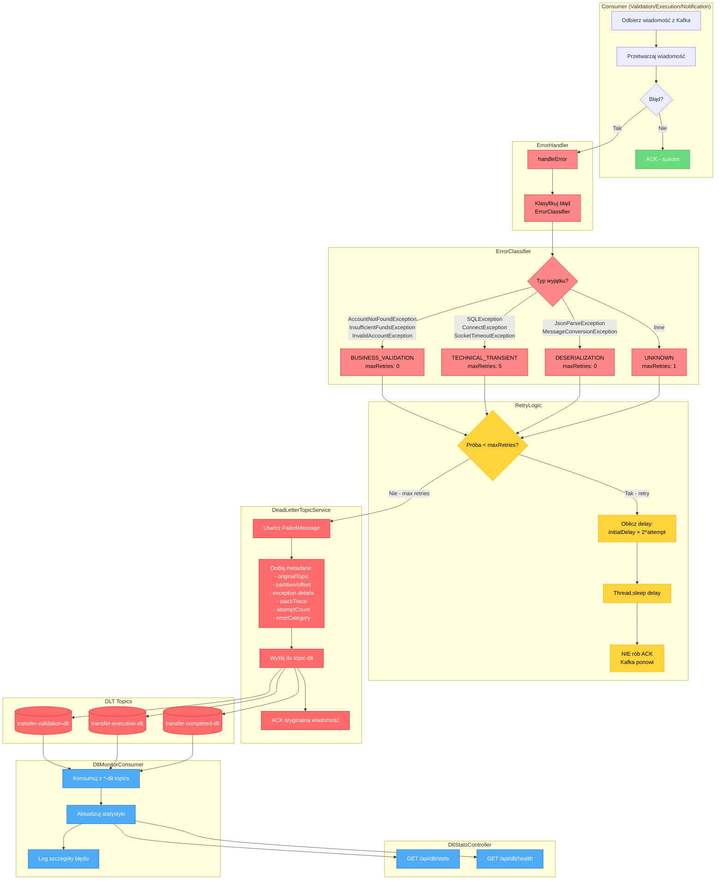
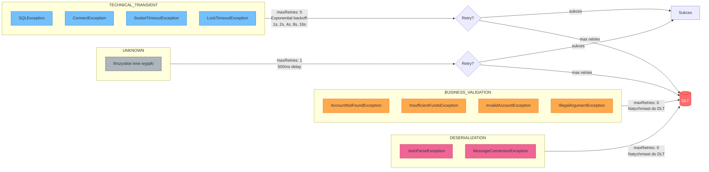
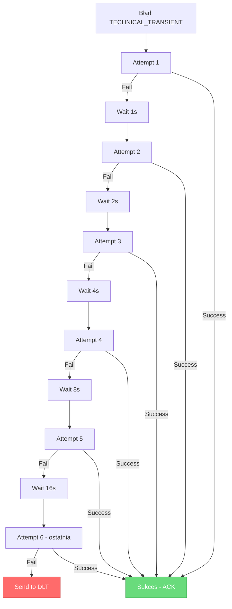
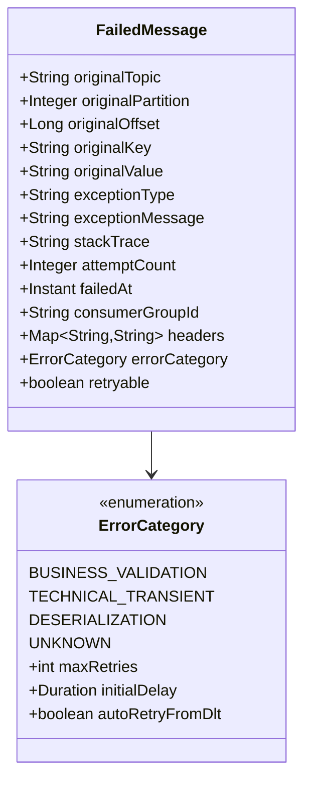
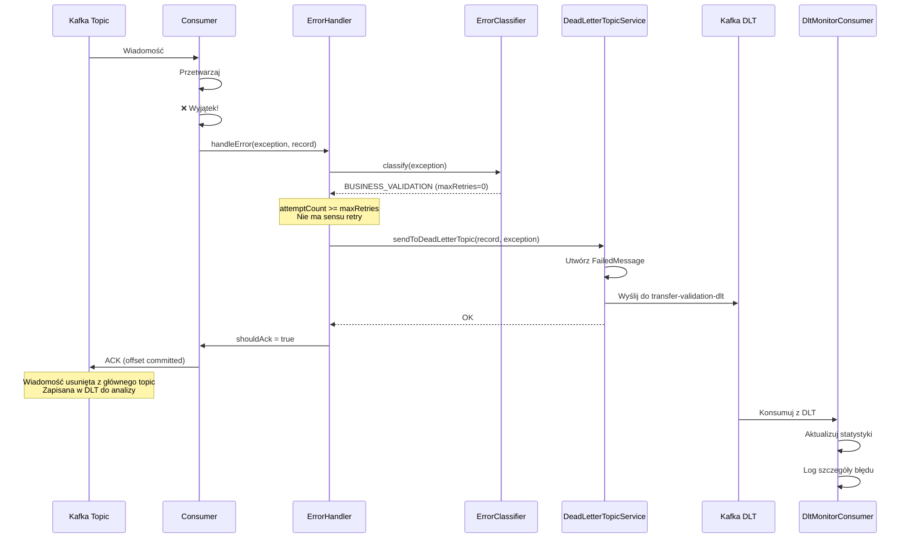

# Error Handling & DLT Flow Diagram

## Przepływ obsługi błędów z Dead Letter Topic



## Klasyfikacja błędów i strategia retry



## Exponential Backoff - szczegóły



## Struktura FailedMessage w DLT



## Sekwencja obsługi błędu



## Monitorowanie DLT - REST API

| Endpoint | Opis | Odpowiedź |
|----------|------|-----------|
| `GET /api/dlt/stats` | Statystyki DLT | `{totalSentToDlt, byTopic, byCategory}` |
| `GET /api/dlt/health` | Health check | `{status, totalDltMessages, threshold}` |

### Przykład odpowiedzi `/api/dlt/stats`:

```json
{
  "totalSentToDlt": 5,
  "byTopic": {
    "transfer-validation": 3,
    "transfer-execution": 2
  },
  "byCategory": {
    "BUSINESS_VALIDATION": 4,
    "TECHNICAL_TRANSIENT": 1
  }
}
```

## Kluczowe zasady DLT

| Zasada | Opis |
|--------|------|
| **Nie blokuj partycji** | Błędne wiadomości trafiają do DLT, nie blokują kolejki |
| **Zachowaj kontekst** | FailedMessage zawiera wszystkie informacje do debugowania |
| **Retencja 30 dni** | DLT topics mają dłuższą retencję niż główne |
| **Monitorowanie** | Alerting gdy >100 wiadomości w DLT |
| **Separacja kategorii** | Różne strategie dla różnych typów błędów |
