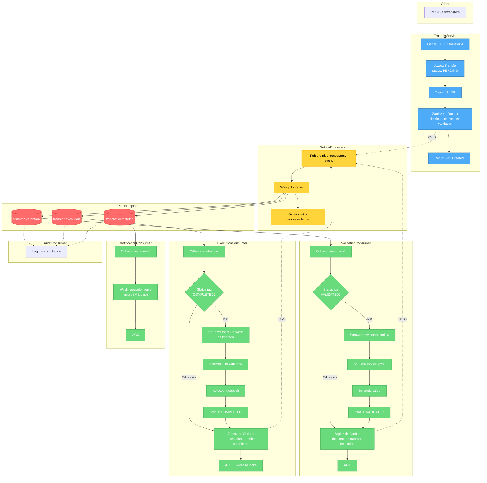
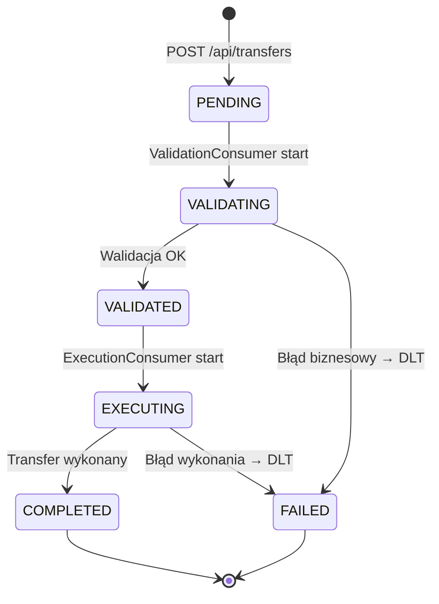
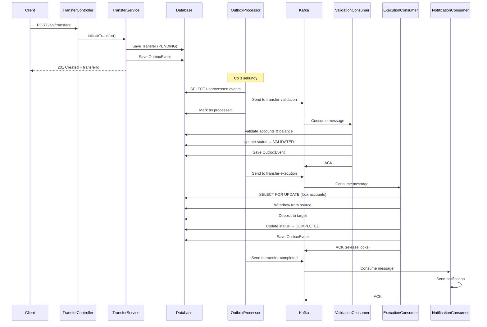

# Transfer Flow Diagram

## Główny przepływ transferu (Happy Path)

## Status Transfer - Maszyna stanów

## Sekwencja czasowa

## Kluczowe cechy

| Cecha | Implementacja |
|-------|--------------|
| **Atomowość** | Outbox Pattern - DB + Event w jednej transakcji |
| **Idempotencja** | UUID transferId + sprawdzanie statusu |
| **Exactly-once** | Manual ACK + idempotency checks |
| **Spójność danych** | Pessimistic locking (SELECT FOR UPDATE) |
| **Kolejność** | Partycjonowanie po fromAccountNumber |
| **Audyt** | Osobny consumer group dla audit-group |
