# Transfer Flow Diagram

## Main Transfer Flow (Happy Path)

```mermaid
flowchart TD
    subgraph Client
        A[POST /api/transfers]
    end

    subgraph TransferService
        B[Generate UUID transferId]
        C[Create Transfer<br/>status: PENDING]
        D[Save to DB]
        E[Save to Outbox<br/>destination: transfer-validation]
        F[Return 201 Created]
    end

    subgraph OutboxProcessor
        G[Fetch unprocessed event]
        H[Send to Kafka]
        I[Mark as processed=true]
    end

    subgraph Kafka Topics
        K1[(transfer-validation)]
        K2[(transfer-execution)]
        K3[(transfer-completed)]
    end

    subgraph ValidationConsumer
        V1[Receive message]
        V2{Status already<br/>VALIDATED?}
        V3[Check accounts exist]
        V4[Check accounts active]
        V5[Check balance]
        V6[Status: VALIDATED]
        V7[Save to Outbox<br/>destination: transfer-execution]
        V8[ACK]
    end

    subgraph ExecutionConsumer
        E1[Receive message]
        E2{Status already<br/>COMPLETED?}
        E3[SELECT FOR UPDATE<br/>lock accounts]
        E4[fromAccount.withdraw]
        E5[toAccount.deposit]
        E6[Status: COMPLETED]
        E7[Save to Outbox<br/>destination: transfer-completed]
        E8[ACK + Release locks]
    end

    subgraph NotificationConsumer
        N1[Receive message]
        N2[Send notification<br/>email/SMS/push]
        N3[ACK]
    end

    subgraph AuditConsumer
        AU[Log for compliance]
    end

    %% Main Flow
    A --> B --> C --> D --> E --> F

    %% Outbox to Validation
    E -.->|every 3s| G
    G --> H --> I
    H --> K1

    %% Validation Consumer
    K1 --> V1 --> V2
    V2 -->|Yes - skip| V7
    V2 -->|No| V3 --> V4 --> V5 --> V6 --> V7 --> V8

    %% Outbox to Execution
    V7 -.->|every 3s| G
    H --> K2

    %% Execution Consumer
    K2 --> E1 --> E2
    E2 -->|Yes - skip| E7
    E2 -->|No| E3 --> E4 --> E5 --> E6 --> E7 --> E8

    %% Outbox to Completed
    E7 -.->|every 3s| G
    H --> K3

    %% Notification Consumer
    K3 --> N1 --> N2 --> N3

    %% Audit parallel
    K1 & K2 & K3 -.-> AU

    %% Styling
    classDef kafka fill:#ff6b6b,stroke:#c92a2a,color:#fff
    classDef service fill:#4dabf7,stroke:#1864ab,color:#fff
    classDef consumer fill:#69db7c,stroke:#2f9e44,color:#fff
    classDef outbox fill:#ffd43b,stroke:#fab005,color:#000

    class K1,K2,K3 kafka
    class B,C,D,E,F service
    class V1,V2,V3,V4,V5,V6,V7,V8,E1,E2,E3,E4,E5,E6,E7,E8,N1,N2,N3 consumer
    class G,H,I outbox
```

## Transfer Status - State Machine

## Time Sequence

## Key Features

| Feature | Implementation |
|---------|---------------|
| **Atomicity** | Outbox Pattern - DB + Event in single transaction |
| **Idempotency** | UUID transferId + status checks |
| **Exactly-once** | Manual ACK + idempotency checks |
| **Data consistency** | Pessimistic locking (SELECT FOR UPDATE) |
| **Ordering** | Partitioning by fromAccountNumber |
| **Audit** | Separate consumer group for audit-group |
